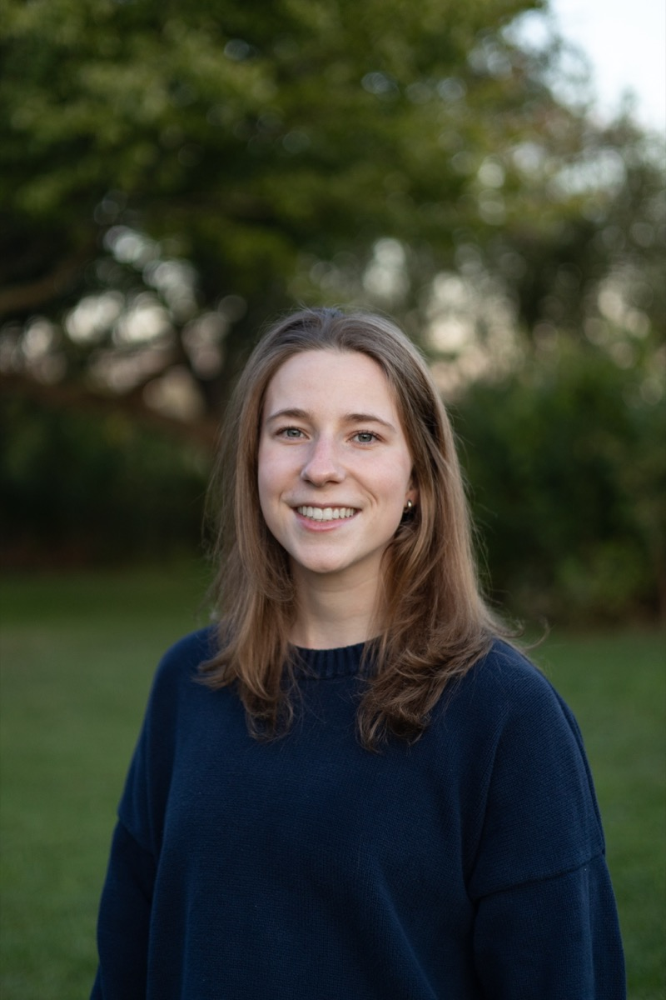

:::: {.grid}

::: {.g-col-12 .g-col-md-4 .headshot-frame}
::: {.headshot-circle}

:::
:::

::: {.g-col-12 .g-col-md-8 .name-block}

# Gabrielle Sorresso {.site-name}

*PhD Candidate, Cornell Jeb E. Brooks School of Public Policy*

:::

::: {.g-col-12 .g-col-md-8 .bio-block}

Hi, I'm Gabrielle — a 5th-year PhD candidate at the Cornell Jeb E. Brooks School of Public Policy. I'm an applied microeconomist with research interests in health economics and gender. I use causal inference methods and large-scale administrative data, generally healthcare claims, to study the impacts of policy on maternal and children's health, mental health, and physician behavior in the healthcare system.

Right now, I'm working on a project examining the *Dobbs* decision and maternal health, which was recently recognized with the [Horowitz Foundation's Most Outstanding Project Award](https://publicpolicy.cornell.edu/news/brooks-phd-student-earns-horowitz-foundations-most-outstanding-project-award/). I also have a joint project with [Colleen Carey](https://sites.google.com/site/colleenmariecarey/) and [Amanda Agan](https://sites.google.com/site/amandayagan/) studying how state medical board disciplinary actions shape physicians' future provision of care.

My other work in progress looks at *Dobbs* and infant health, as well as environmental air pollution and children's mental health.

<a class="btn btn-primary" href="mailto:gns36@cornell.edu">Email Me</a>
<a class="btn btn-primary" href="cv.qmd">View CV</a>

:::

::::
